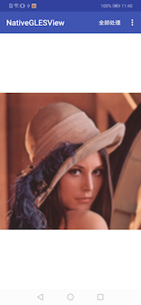
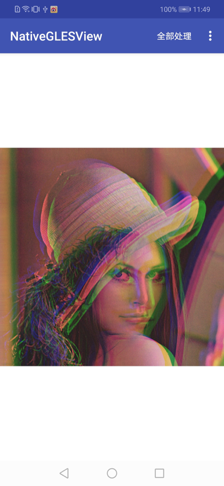

# OpenGLES
    opengles基础整理

## 项目结构

    .
    ├── CMakeLists.txt
    │   ├── main
    │   │   ├── AndroidManifest.xml
    │   │   ├── assets
    │   │   │   ├── filter
    │   │   │   │   ├── color_fragment.sh
    │   │   │   │   ├── default_fragment.sh
    │   │   │   │   ├── default_vertex.sh
    │   │   │   │   ├── fugu_fragment.sh
    │   │   │   │   ├── half_color_fragment.glsl
    │   │   │   │   └── half_color_vertex.glsl
    │   │   │   └── texture
    │   │   │       └── fengmian.jpg
    │   │   ├── java
    │   │   │   └── com
    │   │   │       └── opengles
    │   │   │           └── nativeglesview
    │   │   │               ├── Activity
    │   │   │               │   ├── CommonTranglesActivity.java
    │   │   │               │   ├── EGLActivity.java
    │   │   │               │   ├── EglSurfaceActivity.java
    │   │   │               │   ├── FBOActivity.java
    │   │   │               │   ├── NativeTranglesActivity.java
    │   │   │               │   └── imageManageActivity.java
    │   │   │               ├── EGLHepler
    │   │   │               │   └── EglHelper.java
    │   │   │               ├── MainActivity.java
    │   │   │               ├── Render
    │   │   │               │   ├── CommonTranglesRenderer.java
    │   │   │               │   ├── EGLRender.java
    │   │   │               │   ├── FBORenderer.java
    │   │   │               │   ├── MyRenderer.java
    │   │   │               │   └── SGLRender.java
    │   │   │               ├── Shape
    │   │   │               │   ├── Shape.java
    │   │   │               │   └── Shape_FBO.java
    │   │   │               ├── View
    │   │   │               │   ├── EglSurfaceView.java
    │   │   │               │   ├── MySurfaceView.java
    │   │   │               │   └── SGLView.java
    │   │   │               ├── filter
    │   │   │               │   ├── AFilter.java
    │   │   │               │   ├── ColorFilter.java
    │   │   │               │   └── ContrastColorFilter.java
    │   │   │               └── util
    │   │   │                   ├── ShaderSoucreType.java
    │   │   │                   ├── ShaderUtil.java
    │   │   │                   └── ShaderUtils.java
        
# native 绘制三角形
   ## 时间：2019.4.8
   ### native 绘制三角形
     1.引入了glm库
     2.编写CMake链接glm库
     3.成功链接
     4.GLUtil工具类
     5.Shape绘制类
     6.将GLUtil工具类、Shape绘制类链接
     7.通过Activity包下的NativeTranglesActivity调用进行呈现
   ### 代码查看顺序
      NativeTranglesActivity->MyRenderer->native-lib.cpp
# 普通方式绘制三角形
   ## 时间：2019.4.10
   ### 普通方式绘制三角形
      1.实现Shape目录下的Shape类,准备好三角形数据
      2.CommonTranglesRender渲染器重写Render接口
      3.入口CommonTranglesActivity
   ### 代码查看顺序
      CommonTranglesActivity->CommonTranglesRender->Shape
# FBO离屏渲染
   ## 时间：2019.4.14
   ### FBO离屏渲染，指定FrameBuffer绘制图片，不使用窗口默认Buffer
       1.实现Shape目录下的Shape_FBO类,准备好图片数据
       2.FBORender渲染器重写Render接口
       3.入口FBOActivity
   ### 代码查看顺序
        FBOActivity->FBORender->Shape_FBO
# 创建EGL环境
   ## 时间：2019.4.16
   ### 不使用默认Android搭建好的EGL渲染环境，自定义实现
      1.EGLHelper包下的EglHelper，根据设备创建了EGL环境
      2.EGLActivity，重写了Surface下的三个方法
   ### 代码查看顺序
       EGLActivity->EGLHelper
       
# 自定义GLsurfaceView
   ## 时间：2019.4.25
   ### 自定义GLsurfaceView EglSurfaceView
   #### 继承了SurfaceView,实现了SurfaceHolder.Callback,创建GLThread线程,Render接口
      1.EglSurfaceView继承了SurfaceView,实现了SurfaceHolder.Callback,创建GLThread线程,Render接口
      2.EGLRender实现了EglSurfaceView中的Render接口
      3.EGLActivity入口activity
   ### 代码查看顺序
       EGLActivity->.EglSurfaceView->EGLRender
#  引入图像处理（滤镜）
   ## 时间：2019.5.5
   ### 通过shader处理图像，模拟滤镜
   ### 代码查看路径
       ---Activity
        |     |-- imageManageActivity   
        |
       ---filter
        |     |-- AFilter     
        |     |-- ColorFilter
        |     |-- ContrastColorFilter
       ---Render
        |     |--SGLRender 
       ---View
           |--SGLView 
   ### 示意图
   
    
    
   
     
    
